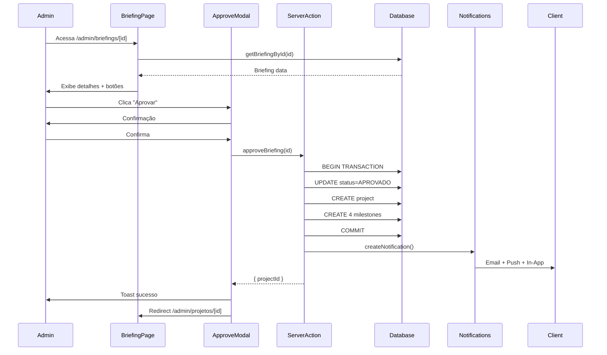

# Sistema de Gestão de Briefings - Admin

Sistema completo para administração de briefings de clientes, incluindo fluxo de aprovação, rejeição e criação automática de projetos.

## Sumário

- [Visão Geral](#visão-geral)
- [Estrutura de Arquivos](#estrutura-de-arquivos)
- [Fluxo de Aprovação](#fluxo-de-aprovação)
- [Server Actions](#server-actions)
- [Componentes](#componentes)
- [Regras de Negócio](#regras-de-negócio)
- [Sistema de Notificações](#sistema-de-notificações)

## Visão Geral

O sistema de gestão de briefings permite que administradores visualizem, analisem e gerenciem briefings enviados por clientes. O fluxo principal inclui:

1. **Listagem**: Visualização de todos os briefings com filtros e estatísticas
2. **Detalhes**: Visualização completa das informações do briefing
3. **Aprovação**: Aprovação do briefing com criação automática de projeto
4. **Rejeição**: Rejeição do briefing com motivo obrigatório

## Estrutura de Arquivos

```
app/(admin)/admin/briefings/
├── page.tsx                    # Server Component - Listagem
├── BriefingsListClient.tsx     # Client Component - Listagem
└── [id]/
    ├── page.tsx                # Server Component - Detalhes
    └── BriefingDetailsClient.tsx # Client Component - Detalhes

components/admin/
├── BriefingStatusBadge.tsx     # Badge de status com cores
├── BriefingTable.tsx           # Tabela com filtros e paginação
├── BriefingDetails.tsx         # Visualização detalhada
├── ApproveBriefingModal.tsx    # Modal de aprovação
└── RejectBriefingModal.tsx     # Modal de rejeição

app/actions/
└── admin-briefings.ts          # Server Actions

lib/
├── briefing-utils.ts           # Helpers e formatters
└── validations/
    └── admin-briefing.ts       # Schemas Zod

types/
└── admin-briefing.ts           # TypeScript interfaces

docs/
└── admin-briefing-management.md # Esta documentação
```

## Fluxo de Aprovação



### Transições de Status Válidas

```
RASCUNHO → ENVIADO
ENVIADO → EM_ANALISE
ENVIADO → APROVADO (via approveBriefing)
ENVIADO → REJEITADO (via rejectBriefing)
EM_ANALISE → ENVIADO
EM_ANALISE → APROVADO (via approveBriefing)
EM_ANALISE → REJEITADO (via rejectBriefing)
APROVADO → (final, não pode alterar)
REJEITADO → (final, não pode alterar)
```

## Server Actions

### `getAllBriefings(filters?)`

Busca todos os briefings com filtros opcionais.

**Parâmetros:**

```typescript
interface BriefingFilters {
  status?: BriefingStatus;
  serviceType?: ServiceType;
  searchTerm?: string;
  dateFrom?: Date;
  dateTo?: Date;
}
```

**Retorno:**

```typescript
{
  success: boolean;
  data?: {
    briefings: BriefingListItem[];
    stats: BriefingStats;
  };
  error?: string;
}
```

### `getBriefingById(briefingId)`

Busca um briefing específico com todas as relações.

**Retorno:** `BriefingWithRelations`

### `approveBriefing(briefingId, adminId)`

Aprova um briefing e cria um projeto automaticamente.

**Ações:**

1. Valida se briefing está em status ENVIADO ou EM_ANALISE
2. Atualiza status para APROVADO
3. Define `reviewedAt` para data atual
4. Cria projeto com nome da empresa
5. Cria 4 milestones padrão: Planejamento, Desenvolvimento, Testes, Entrega
6. Envia notificação ao cliente

**Retorno:** `{ projectId: string }`

### `rejectBriefing(briefingId, adminId, reason)`

Rejeita um briefing com motivo obrigatório.

**Validações:**

- Motivo deve ter entre 10 e 500 caracteres
- Briefing deve estar em ENVIADO ou EM_ANALISE

**Ações:**

1. Atualiza status para REJEITADO
2. Salva `rejectionReason`
3. Define `reviewedAt`
4. Envia notificação ao cliente com motivo

### `updateBriefingStatus(briefingId, status)`

Atualiza status manualmente (não permite APROVADO/REJEITADO).

### `markBriefingAsInAnalysis(briefingId)`

Atalho para marcar briefing como EM_ANALISE.

## Componentes

### BriefingStatusBadge

Badge visual para status com cores e ícones.

```tsx
<BriefingStatusBadge status={briefing.status} showIcon={true} />
```

**Cores:**

- RASCUNHO: Cinza
- ENVIADO: Azul
- EM_ANALISE: Amarelo
- APROVADO: Verde
- REJEITADO: Vermelho

### BriefingTable

Tabela com filtros, busca e paginação.

**Funcionalidades:**

- Filtro por status
- Filtro por tipo de serviço
- Busca por cliente/email/empresa
- Paginação (10 itens por página)
- Ordenação por data DESC

### BriefingDetails

Visualização detalhada em layout de 2 colunas.

**Coluna 1 - Cliente:**

- Nome, Email, Telefone, Empresa
- Histórico de timestamps
- Status atual
- Motivo de rejeição (se aplicável)
- Link para projeto vinculado

**Coluna 2 - Briefing:**

- Tipo de serviço, Nome da empresa, Segmento
- Objetivos (textarea)
- Orçamento e Prazo
- Features, Referências, Integrações (se preenchidos)
- Informações adicionais em JSON

### ApproveBriefingModal

Modal de confirmação para aprovação.

- Mostra passos que serão executados
- Loading state durante processamento
- Redireciona para página do projeto após sucesso

### RejectBriefingModal

Modal com formulário para rejeição.

- Campo de motivo obrigatório (10-500 caracteres)
- Validação com react-hook-form + zod
- Aviso sobre notificação ao cliente

## Regras de Negócio

### Validações de Aprovação

```typescript
canApproveBriefing(briefing): boolean {
  return status === 'ENVIADO' || status === 'EM_ANALISE';
}
```

- Briefing não pode estar já aprovado
- Não pode ter projeto vinculado
- Cria transação atômica (briefing + projeto + milestones)

### Validações de Rejeição

```typescript
canRejectBriefing(briefing): boolean {
  return status === 'ENVIADO' || status === 'EM_ANALISE';
}
```

- Motivo obrigatório: mínimo 10 caracteres
- Motivo máximo: 500 caracteres
- Cliente notificado via todos os canais

### Criação de Projeto

Ao aprovar, o sistema cria automaticamente:

1. **Projeto:**
   - name: companyName do briefing
   - description: objectives do briefing
   - status: AGUARDANDO_APROVACAO
   - progress: 0

2. **Milestones:**
   - Planejamento (order: 1)
   - Desenvolvimento (order: 2)
   - Testes (order: 3)
   - Entrega (order: 4)

## Sistema de Notificações

### Notificação de Aprovação

```typescript
{
  type: 'BRIEFING_APROVADO',
  title: 'Briefing Aprovado! 🎉',
  message: 'Seu briefing para {companyName} foi aprovado...',
  channels: ['IN_APP', 'EMAIL', 'PUSH'],
  metadata: {
    briefingId,
    projectId,
    companyName
  }
}
```

### Notificação de Rejeição

```typescript
{
  type: 'BRIEFING_REJEITADO',
  title: 'Briefing Rejeitado',
  message: 'Seu briefing para {companyName} não pôde ser aprovado. Motivo: {reason}',
  channels: ['IN_APP', 'EMAIL', 'PUSH'],
  metadata: {
    briefingId,
    rejectionReason,
    companyName
  }
}
```

## Performance

### React Query Configuração

```typescript
const { data, isLoading, refetch } = useQuery({
  queryKey: ['admin-briefings', filters],
  queryFn: () => getAllBriefings(filters),
  initialData: initialBriefings,
  refetchInterval: 30000, // 30 segundos
  staleTime: 10000, // 10 segundos
});
```

### Cache Invalidation

Após ações de aprovação/rejeição:

```typescript
queryClient.invalidateQueries({ queryKey: ['admin-briefings'] });
queryClient.invalidateQueries({ queryKey: ['briefing', briefingId] });
```

## Exemplos de Uso

### Aprovar Briefing

```typescript
const result = await approveBriefing(briefingId, adminId);
if (result.success) {
  router.push(`/admin/projetos/${result.data.projectId}`);
}
```

### Rejeitar Briefing

```typescript
const result = await rejectBriefing(briefingId, adminId, 'Orçamento insuficiente para o escopo...');
if (result.success) {
  toast.success('Briefing rejeitado');
}
```

### Buscar com Filtros

```typescript
const result = await getAllBriefings({
  status: 'ENVIADO',
  searchTerm: 'empresa xyz',
});
```

## Screenshots

_(Adicione screenshots da interface quando disponíveis)_

- Listagem de briefings com filtros
- Página de detalhes com ações
- Modal de aprovação
- Modal de rejeição
