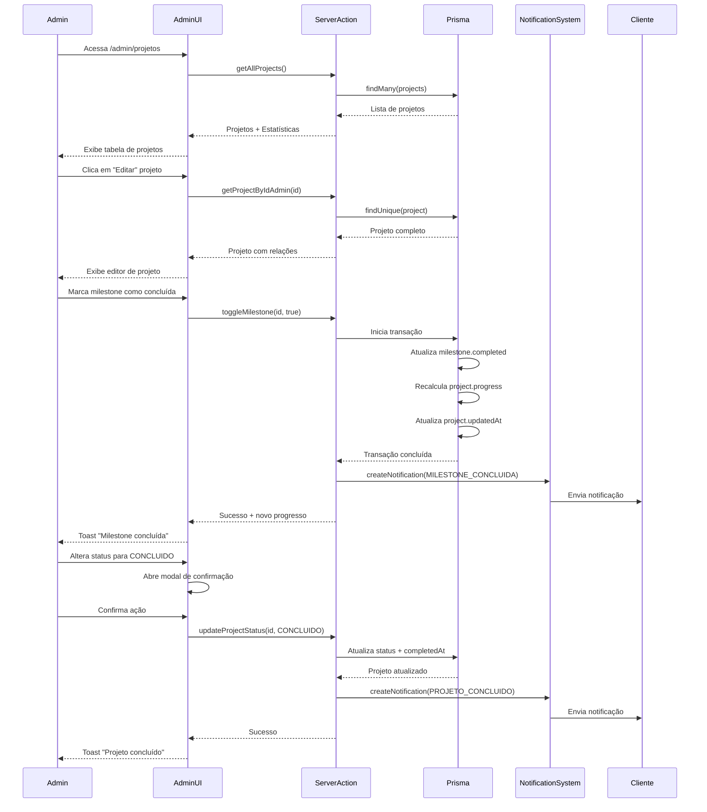
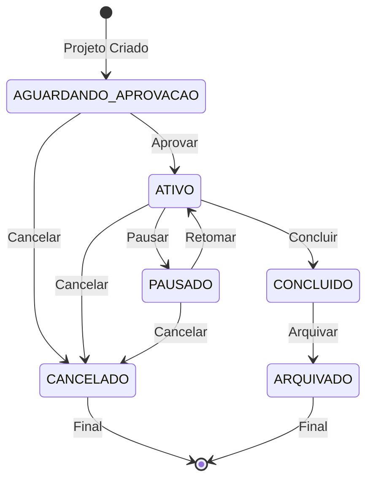

# Sistema de Gestão de Projetos - Admin

Sistema completo para administração de projetos de clientes, incluindo gestão de milestones, alteração de status e notificações automáticas.

## Sumário

- [Visão Geral](#visão-geral)
- [Estrutura de Arquivos](#estrutura-de-arquivos)
- [Fluxo de Gestão](#fluxo-de-gestão)
- [Diagrama de Estados](#diagrama-de-estados)
- [Server Actions](#server-actions)
- [Componentes](#componentes)
- [Regras de Negócio](#regras-de-negócio)
- [Sistema de Notificações](#sistema-de-notificações)

## Visão Geral

O sistema de gestão de projetos permite que administradores:

1. **Listem projetos**: Visualização de todos os projetos com filtros e estatísticas
2. **Gerenciem milestones**: Marcar/desmarcar milestones como concluídas
3. **Alterem status**: Mudar status do projeto seguindo regras de transição
4. **Adicionem notas**: Comunicação com clientes através de comentários

## Estrutura de Arquivos

```
app/(admin)/admin/projetos/
├── page.tsx                      # Server Component - Listagem
├── ProjectsListClient.tsx        # Client Component - Listagem
└── [id]/
    ├── page.tsx                  # Server Component - Edição
    └── ProjectEditorClient.tsx   # Client Component - Editor

components/admin/
├── ProjectTable.tsx              # Tabela com filtros e paginação
├── AdminProjectTimeline.tsx      # Timeline interativa de milestones
├── MilestoneCheckbox.tsx         # Checkbox de milestone
├── ConfirmActionModal.tsx        # Modal de confirmação
└── MetricsCard.tsx               # Cards de estatísticas

app/actions/
└── admin-projects.ts             # Server Actions

types/
└── admin-project.ts              # TypeScript interfaces

lib/validations/
└── admin-projects.ts             # Schemas Zod

docs/
└── admin-project-management.md   # Esta documentação
```

## Fluxo de Gestão



## Diagrama de Estados



### Transições de Status Válidas

| De                   | Para      | Ação                 | Notificação             |
| -------------------- | --------- | -------------------- | ----------------------- |
| AGUARDANDO_APROVACAO | ATIVO     | Define `startedAt`   | Não                     |
| AGUARDANDO_APROVACAO | CANCELADO | -                    | Não                     |
| ATIVO                | PAUSADO   | -                    | Não                     |
| ATIVO                | CONCLUIDO | Define `completedAt` | Sim (PROJETO_CONCLUIDO) |
| ATIVO                | CANCELADO | -                    | Sim (com confirmação)   |
| PAUSADO              | ATIVO     | -                    | Não                     |
| PAUSADO              | CANCELADO | -                    | Não                     |
| CONCLUIDO            | ARQUIVADO | -                    | Não                     |

## Server Actions

### `getAllProjects(filters?)`

Busca todos os projetos com filtros opcionais.

**Parâmetros:**

```typescript
interface AdminProjectFilters {
  status?: ProjectStatus;
  userId?: string;
  serviceType?: ServiceType;
  searchTerm?: string;
  dateFrom?: Date;
  dateTo?: Date;
}
```

**Retorno:**

```typescript
{
  success: boolean;
  data?: {
    projects: AdminProjectListItem[];
    stats: AdminProjectStats;
  };
  error?: string;
}
```

### `getProjectByIdAdmin(projectId)`

Busca um projeto específico com todas as relações.

**Retorno:** `AdminProjectWithRelations`

### `updateProjectStatus(projectId, newStatus)`

Atualiza o status do projeto com validação de transições.

**Regras:**

- Define `startedAt` ao ativar projeto
- Define `completedAt` ao concluir
- Envia notificação ao concluir
- Requer confirmação para CANCELADO/ARQUIVADO

### `toggleMilestone(milestoneId, completed)`

Alterna o estado de uma milestone.

**Ações:**

1. Atualiza `milestone.completed` e `completedAt`
2. Recalcula `project.progress` (4 milestones = 25% cada)
3. Atualiza `project.updatedAt`
4. Envia notificação se concluída

### `addProjectNote(projectId, content)`

Adiciona um comentário administrativo.

**Validações:**

- Conteúdo mínimo: 10 caracteres
- Conteúdo máximo: 1000 caracteres

### `getProjectStats()`

Retorna estatísticas globais para dashboard.

**Retorno:**

```typescript
{
  total: number;
  ativos: number;
  concluidosEsteMes: number;
  taxaConclusao: number;
  tempoMedioConclusao: number;
}
```

## Componentes

### ProjectTable

Tabela com filtros, busca e paginação.

**Filtros:**

- Status (dropdown)
- Tipo de serviço (dropdown)
- Busca por cliente/email/empresa
- Período (date range)

**Colunas:**

- Cliente (nome + email)
- Empresa
- Serviço (do briefing)
- Status (badge)
- Progresso (barra visual %)
- Última Atualização
- Ações

### AdminProjectTimeline

Timeline interativa de milestones.

**Funcionalidades:**

- Checkbox para marcar/desmarcar milestones
- Barra de progresso no topo
- Animação de concluído quando 100%

### MilestoneCheckbox

Checkbox customizado para milestones.

**Props:**

```typescript
interface MilestoneCheckboxProps {
  milestone: ProjectMilestone;
  onToggle: (id: string, completed: boolean) => Promise<void>;
}
```

### ConfirmActionModal

Modal de confirmação para ações críticas.

**Props:**

```typescript
interface ConfirmActionModalProps {
  isOpen: boolean;
  onClose: () => void;
  onConfirm: () => Promise<void> | void;
  title: string;
  message: string;
  confirmText?: string;
  cancelText?: string;
  variant?: 'danger' | 'warning' | 'info';
}
```

### MetricsCard

Card de métricas com ícone e valor.

**Props:**

```typescript
interface MetricsCardProps {
  title: string;
  value: string | number;
  icon: LucideIcon;
  trend?: {
    value: number;
    label: string;
    direction: 'up' | 'down';
  };
  color?: 'primary' | 'emerald' | 'yellow' | 'red' | 'blue';
}
```

## Regras de Negócio

### Cálculo de Progresso

```typescript
function calculateProgress(milestones: ProjectMilestone[]): number {
  if (!milestones || milestones.length === 0) return 0;

  const completedCount = milestones.filter((m) => m.completed).length;
  const progress = (completedCount / 4) * 100; // 4 milestones = 25% cada
  return Math.round(Math.min(Math.max(progress, 0), 100));
}
```

### Validações de Transição de Status

```typescript
const validTransitions: Record<ProjectStatus, ProjectStatus[]> = {
  AGUARDANDO_APROVACAO: ['ATIVO', 'CANCELADO'],
  ATIVO: ['PAUSADO', 'CONCLUIDO', 'CANCELADO'],
  PAUSADO: ['ATIVO', 'CANCELADO'],
  CONCLUIDO: ['ARQUIVADO'],
  CANCELADO: [],
  ARQUIVADO: [],
};
```

### Notificações Automáticas

| Evento              | Tipo                | Título                       | Canais              |
| ------------------- | ------------------- | ---------------------------- | ------------------- |
| Milestone Concluída | MILESTONE_CONCLUIDA | Etapa "[nome]" Concluída! 🎉 | IN_APP, EMAIL, PUSH |
| Projeto Concluído   | PROJETO_CONCLUIDO   | Projeto Concluído! 🚀        | IN_APP, EMAIL, PUSH |
| Nova Mensagem       | NOVA_MENSAGEM       | Nova Mensagem no Projeto     | IN_APP, EMAIL, PUSH |

## Sistema de Notificações

### Notificação de Milestone Concluída

```typescript
await createNotification({
  userId: project.userId,
  type: 'MILESTONE_CONCLUIDA',
  title: `Etapa "${milestone.name}" Concluída! 🎉`,
  message: `A etapa "${milestone.name}" do seu projeto "${project.name}" foi concluída. Progresso atual: ${newProgress}%`,
  channels: ['IN_APP', 'EMAIL', 'PUSH'],
  metadata: {
    projectId: project.id,
    milestoneId: milestone.id,
    milestoneName: milestone.name,
    progress: newProgress,
    actionUrl: `/projetos/${project.id}`,
  },
});
```

### Notificação de Projeto Concluído

```typescript
await createNotification({
  userId: project.userId,
  type: 'PROJETO_CONCLUIDO',
  title: 'Projeto Concluído! 🚀',
  message: `Seu projeto "${project.name}" foi concluído com sucesso. Obrigado por confiar na 28Web Connect!`,
  channels: ['IN_APP', 'EMAIL', 'PUSH'],
  metadata: {
    projectId: project.id,
    projectName: project.name,
    completedAt: new Date().toISOString(),
    actionUrl: `/projetos/${project.id}`,
  },
});
```

## Permissões de Acesso

Apenas usuários com roles `ADMIN` ou `SUPER_ADMIN` podem acessar:

- `/admin/projetos` - Listagem de projetos
- `/admin/projetos/[id]` - Edição de projeto

As server actions verificam autenticação via `auth()` do NextAuth.

## Exemplos de Uso

### Buscar Projetos com Filtros

```typescript
const result = await getAllProjects({
  status: 'ATIVO',
  searchTerm: 'empresa xyz',
  dateFrom: new Date('2024-01-01'),
});
```

### Marcar Milestone como Concluída

```typescript
const result = await toggleMilestone('milestone-123', true);
if (result.success) {
  console.log(`Progresso atual: ${result.data.progress}%`);
}
```

### Alterar Status do Projeto

```typescript
const result = await updateProjectStatus('project-123', 'CONCLUIDO');
if (result.success) {
  console.log(`Status alterado: ${result.data.oldStatus} -> ${result.data.newStatus}`);
}
```

### Adicionar Nota

```typescript
const result = await addProjectNote(
  'project-123',
  'Entrega realizada conforme combinado. Aguardando feedback do cliente.'
);
```

## Performance

### React Query Configuração

```typescript
const { data, isLoading, refetch } = useQuery({
  queryKey: ['admin-projects', filters],
  queryFn: () => getAllProjects(filters),
  initialData: initialProjects,
  refetchInterval: 30000, // 30 segundos
  staleTime: 10000, // 10 segundos
});
```

### Cache Invalidation

Após ações de atualização:

```typescript
queryClient.invalidateQueries({ queryKey: ['admin-projects'] });
queryClient.invalidateQueries({ queryKey: ['admin-project', projectId] });
```

## Testes

Testes unitários em `app/actions/__tests__/admin-projects.test.ts`:

- `getAllProjects()` - listagem, filtros, erro DB
- `getProjectByIdAdmin()` - busca com sucesso, não encontrado
- `updateProjectStatus()` - transições válidas/inválidas, notificações
- `toggleMilestone()` - cálculo de progresso, notificações
- `addProjectNote()` - validação de conteúdo, notificações
- `getProjectStats()` - estatísticas corretas
