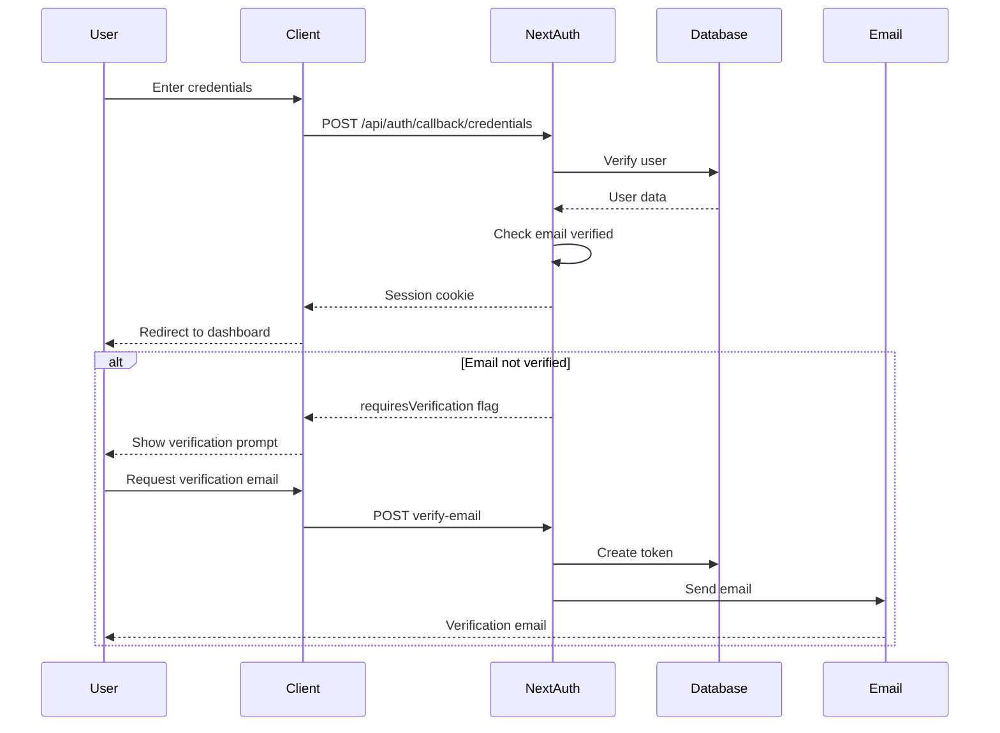

# API Documentation

Comprehensive reference for all API routes in the 28Web Connect platform.

## Table of Contents

- [Authentication](#authentication)
- [Chat](#chat)
- [Upload](#upload)
- [Admin](#admin)
- [Cron Jobs](#cron-jobs)
- [Payload CMS](#payload-cms)
- [Error Codes](#error-codes)

---

## Authentication

### POST /api/auth/[...nextauth]

NextAuth.js authentication endpoint supporting multiple providers.

**Authentication:** Public

**Request Body (Credentials):**

```json
{
  "email": "user@example.com",
  "password": "userPassword123",
  "csrfToken": "token-from-cookie"
}
```

**Response (Success):**

```json
{
  "user": {
    "id": "user-123",
    "name": "João Silva",
    "email": "user@example.com",
    "role": "CLIENTE"
  },
  "expires": "2024-12-31T23:59:59.999Z"
}
```

**Response (Error):**

```json
{
  "error": "CredentialsSignin",
  "message": "Email ou senha incorretos"
}
```

---

### GET /api/auth/verify-email

Verifies email using token sent via email.

**Authentication:** Public

**Query Parameters:**
| Name | Type | Required | Description |
|------|------|----------|-------------|
| token | string | Yes | Verification token from email |

**Response (Success):**
Redirects to `/login?verified=true`

**Response (Error):**
Redirects to `/verificar-email?error=invalid`

---

## Chat

### POST /api/chat

Streaming chat endpoint using Vercel AI SDK with RAG support.

**Authentication:** Authenticated

**Request Headers:**

```
Content-Type: application/json
```

**Request Body:**

```json
{
  "messages": [{ "role": "user", "content": "Como funciona o ERP?" }]
}
```

**Response:**
Server-Sent Events (SSE) stream with AI responses.

**Example with curl:**

```bash
curl -X POST http://localhost:3000/api/chat \
  -H "Content-Type: application/json" \
  -H "Cookie: next-auth.session-token=..." \
  -d '{"messages":[{"role":"user","content":"Olá"}]}'
```

---

## Upload

### POST /api/upload

Uploads a file to a project.

**Authentication:** Authenticated

**Request Headers:**

```
Content-Type: multipart/form-data
```

**Request Body (FormData):**
| Field | Type | Required | Description |
|-------|------|----------|-------------|
| file | File | Yes | File to upload |
| projectId | string | Yes | Project ID |

**Response (Success):**

```json
{
  "success": true,
  "data": {
    "id": "file-123",
    "filename": "documento.pdf",
    "filesize": 1024000,
    "filepath": "uploads/projects/proj-456/documento.pdf",
    "mimetype": "application/pdf"
  }
}
```

**Response (Error):**

```json
{
  "success": false,
  "error": "Limite de armazenamento atingido"
}
```

---

### GET /api/download/[fileId]

Downloads a project file.

**Authentication:** Authenticated (must own project or be admin)

**Path Parameters:**
| Name | Type | Description |
|------|------|-------------|
| fileId | string | File ID to download |

**Response:**
File content with appropriate Content-Type header.

---

## Admin

### GET /api/admin/metrics

Returns platform metrics and statistics.

**Authentication:** Admin only

**Response:**

```json
{
  "success": true,
  "data": {
    "totalUsers": 150,
    "totalBriefings": 75,
    "totalProjects": 45,
    "activeProjects": 30,
    "completedProjects": 15
  }
}
```

---

### GET /api/admin/clients

Returns paginated list of clients.

**Authentication:** Admin only

**Query Parameters:**
| Name | Type | Default | Description |
|------|------|---------|-------------|
| page | number | 1 | Page number |
| limit | number | 20 | Items per page |
| search | string | - | Search term |

**Response:**

```json
{
  "success": true,
  "data": {
    "clients": [...],
    "pagination": {
      "total": 150,
      "page": 1,
      "limit": 20,
      "totalPages": 8
    }
  }
}
```

---

### GET /api/admin/projects

Returns paginated list of all projects.

**Authentication:** Admin only

**Query Parameters:**
| Name | Type | Default | Description |
|------|------|---------|-------------|
| page | number | 1 | Page number |
| limit | number | 20 | Items per page |
| status | string | - | Filter by status |

---

### POST /api/admin/knowledge/upload

Uploads a document to the knowledge base (RAG).

**Authentication:** Admin only

**Request Body (FormData):**
| Field | Type | Required | Description |
|-------|------|----------|-------------|
| file | File | Yes | PDF, DOC, or TXT file |
| metadata | JSON | No | Additional metadata |

---

## Cron Jobs

### GET /api/cron/data-retention

Executes LGPD data retention policies.

**Authentication:** Cron Secret (Header)

**Request Headers:**

```
Authorization: Bearer <CRON_SECRET>
```

**Response:**

```json
{
  "success": true,
  "summary": {
    "warningsSent": 3,
    "usersDeleted": 0,
    "contractualPreserved": 0,
    "briefingsAnonymized": 2
  }
}
```

**Rate Limiting:** Max 1 execution per day

---

## Payload CMS

### ALL /api/payload/[[...slug]]

Payload CMS API endpoints for content management.

**Authentication:** Authenticated (ADMIN or SUPER_ADMIN for mutations)

**Supported Operations:**

- `GET` - List or retrieve documents
- `POST` - Create documents
- `PATCH` - Update documents
- `DELETE` - Remove documents

**Example:**

```bash
# List all posts
curl http://localhost:3000/api/payload/posts \
  -H "Cookie: next-auth.session-token=..."

# Create post
curl -X POST http://localhost:3000/api/payload/posts \
  -H "Content-Type: application/json" \
  -H "Cookie: next-auth.session-token=..." \
  -d '{"title":"New Post","content":"..."}'
```

---

## Error Codes

### HTTP Status Codes

| Code | Description           | Common Causes                      |
| ---- | --------------------- | ---------------------------------- |
| 200  | OK                    | Successful request                 |
| 201  | Created               | Resource created successfully      |
| 400  | Bad Request           | Invalid request body or parameters |
| 401  | Unauthorized          | Missing or invalid authentication  |
| 403  | Forbidden             | Insufficient permissions           |
| 404  | Not Found             | Resource not found                 |
| 422  | Unprocessable Entity  | Validation errors                  |
| 429  | Too Many Requests     | Rate limit exceeded                |
| 500  | Internal Server Error | Server-side error                  |

### Application Error Codes

| Code                     | Description                      |
| ------------------------ | -------------------------------- |
| AUTH_INVALID_CREDENTIALS | Email or password incorrect      |
| AUTH_UNVERIFIED_EMAIL    | Email not verified               |
| AUTH_SESSION_EXPIRED     | Session expired                  |
| VALIDATION_ERROR         | Input validation failed          |
| RESOURCE_NOT_FOUND       | Requested resource doesn't exist |
| PERMISSION_DENIED        | User lacks required permissions  |
| STORAGE_LIMIT_EXCEEDED   | File storage limit reached       |
| RATE_LIMIT_EXCEEDED      | Too many requests                |

---

## Authentication Flow



---

## Rate Limiting

Current rate limits (subject to change):

| Endpoint          | Limit        | Window   |
| ----------------- | ------------ | -------- |
| /api/auth/\*      | 10 requests  | 1 minute |
| /api/chat         | 50 messages  | 1 hour   |
| /api/upload       | 10 files     | 1 hour   |
| /api/\* (general) | 100 requests | 1 minute |

Rate limit headers:

```
X-RateLimit-Limit: 100
X-RateLimit-Remaining: 95
X-RateLimit-Reset: 1704067200
```
