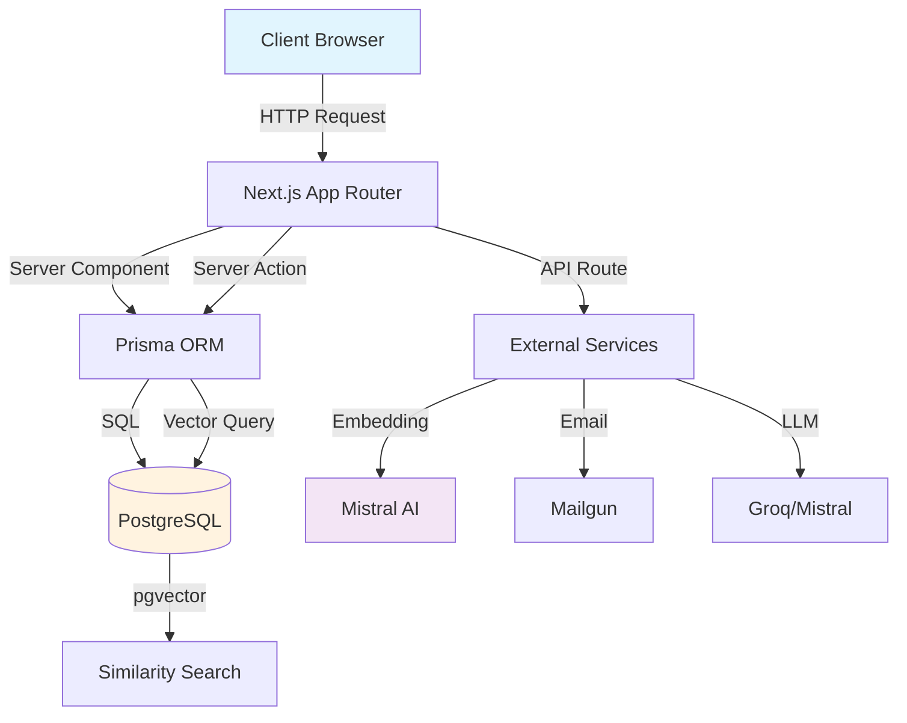
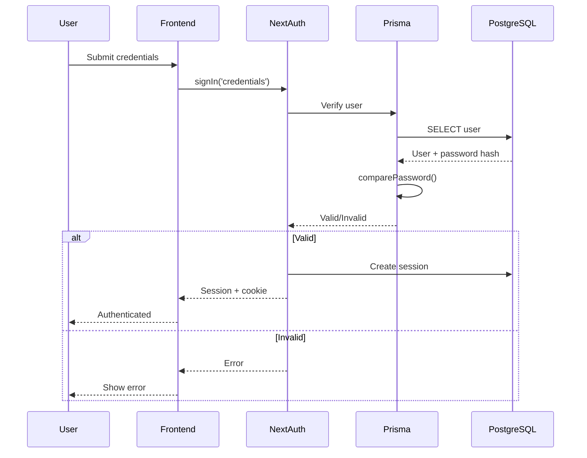
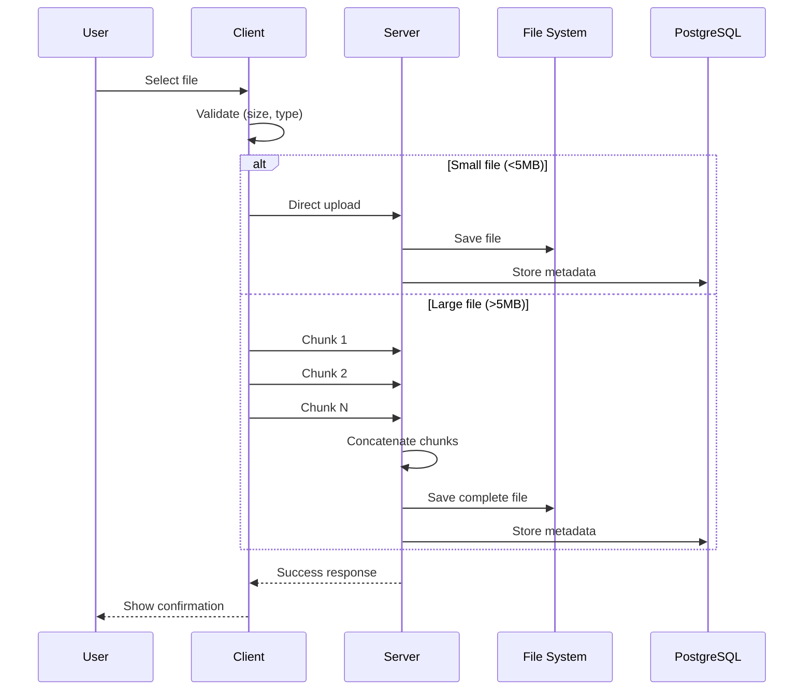
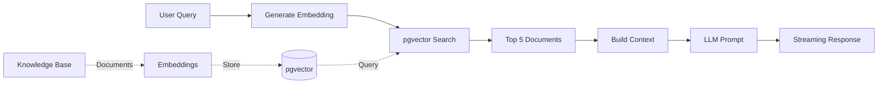
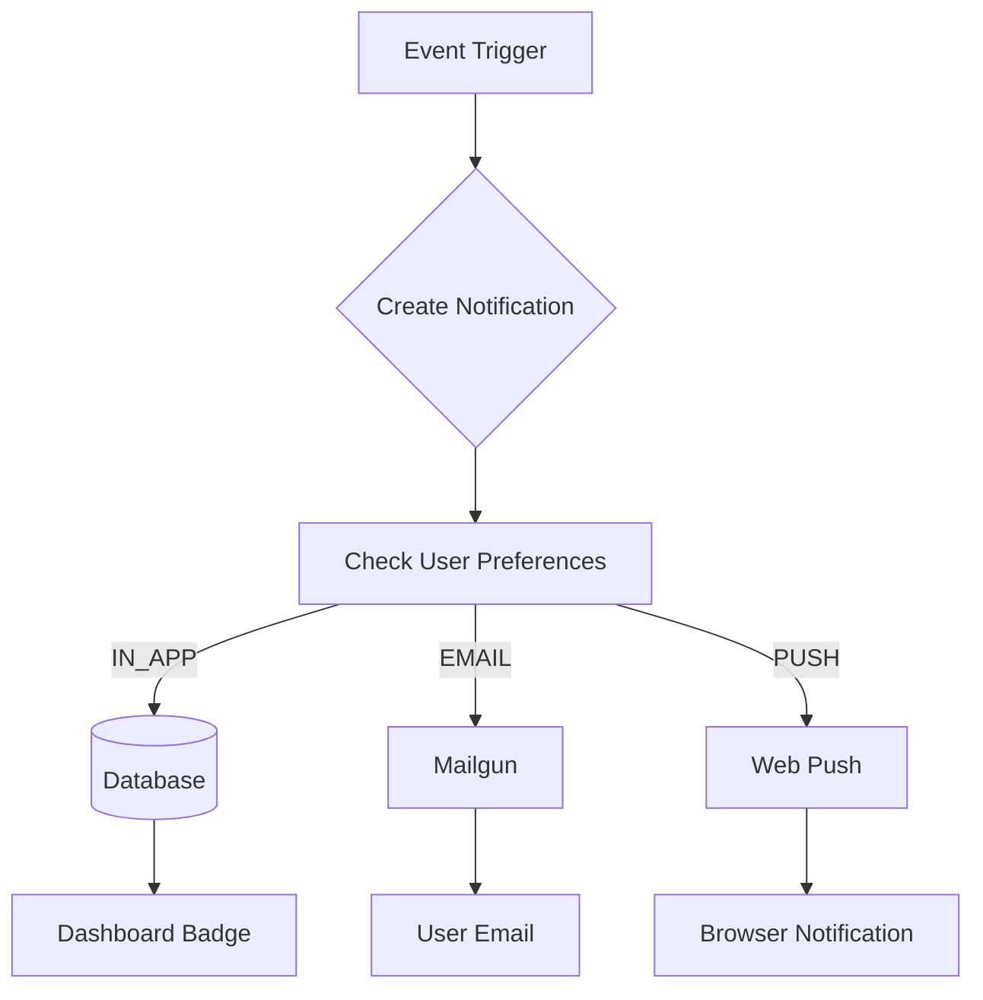
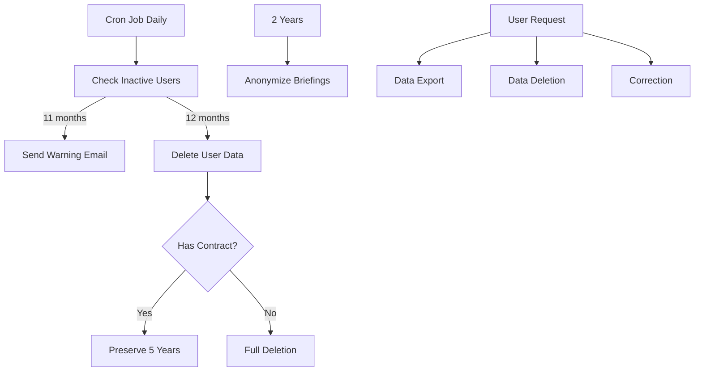
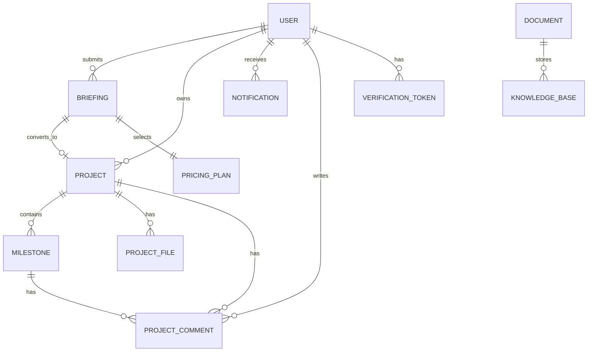

# Architecture Documentation

Overview of the 28Web Connect platform architecture and design decisions.

## Table of Contents

- [Technology Stack](#technology-stack)
- [Folder Structure](#folder-structure)
- [Route Groups](#route-groups)
- [Data Flow](#data-flow)
- [Authentication](#authentication)
- [State Management](#state-management)
- [File Upload](#file-upload)
- [RAG System](#rag-system)
- [Notifications](#notifications)
- [LGPD Compliance](#lgpd-compliance)
- [Deployment](#deployment)
- [Database Schema](#database-schema)

---

## Technology Stack

| Category      | Technology                 | Purpose                       |
| ------------- | -------------------------- | ----------------------------- |
| **Framework** | Next.js 14+ (App Router)   | React framework with SSR/SSG  |
| **Language**  | TypeScript                 | Type-safe JavaScript          |
| **Styling**   | Tailwind CSS               | Utility-first CSS             |
| **Database**  | PostgreSQL + pgvector      | Primary data + vector storage |
| **ORM**       | Prisma                     | Database access layer         |
| **Auth**      | NextAuth.js v5             | Authentication system         |
| **AI/ML**     | Mistral AI + Vercel AI SDK | LLM and embeddings            |
| **CMS**       | Payload CMS v2             | Content management            |
| **Storage**   | Local filesystem + SQLite  | File storage + CMS data       |

---

## Folder Structure

```
├── app/                    # Next.js App Router
│   ├── (site)/            # Public site routes
│   ├── (auth)/            # Authentication routes
│   ├── (dashboard)/       # Client dashboard routes
│   ├── (admin)/           # Admin panel routes
│   ├── (payload)/         # CMS admin routes
│   ├── actions/           # Server Actions
│   └── api/               # API routes
├── components/            # React components
│   ├── ui/               # Reusable UI components
│   └── forms/            # Form components
├── lib/                   # Utilities and configs
│   ├── validations/      # Zod schemas
│   └── email-templates/  # Email templates
├── types/                 # TypeScript types
├── prisma/                # Database schema
├── collections/           # Payload CMS collections
├── docs/                  # Documentation
└── scripts/               # Utility scripts
```

---

## Route Groups

### (site) - Public Site

- `/` - Homepage
- `/sobre` - About page
- `/blog` - Blog listing
- `/portfolio` - Portfolio showcase
- `/precos` - Pricing page

### (auth) - Authentication

- `/login` - Login page
- `/cadastro` - Registration
- `/esqueci-senha` - Password reset

### (dashboard) - Client Dashboard

- `/dashboard` - Dashboard home
- `/dashboard/briefing` - Briefing form
- `/dashboard/projetos` - Projects list
- `/dashboard/projetos/[id]` - Project details

### (admin) - Admin Panel

- `/admin` - Admin dashboard
- `/admin/briefings` - Briefing management
- `/admin/projetos` - Project management
- `/admin/clientes` - Client management

### (payload) - CMS

- `/cms` - Payload CMS admin

---

## Data Flow



---

## Authentication

NextAuth.js v5 with Credentials Provider and Prisma Adapter.



**Security Features:**

- bcrypt password hashing (12 rounds)
- CSRF protection
- Session-based authentication
- Email verification required
- Role-based access control

---

## State Management

### Server Components (Default)

- Data fetching via Server Actions
- No client-side state needed
- Automatic caching and revalidation

### Client Components (When needed)

- `useState` for local UI state
- `useEffect` for side effects
- Server Actions for mutations

### Server Actions Pattern

```typescript
// Server Action
'use server';
export async function updateData(formData: FormData) {
  const session = await requireAuth();
  // Validation + Database update
  revalidatePath('/dashboard');
}
```

---

## File Upload



**Features:**

- Chunked upload for large files
- MIME type validation
- Storage quota enforcement
- Automatic cleanup on failure

---

## RAG System

Retrieval-Augmented Generation for AI chat responses.



**Components:**

- **Embedding**: Mistral AI (1536 dimensions)
- **Storage**: PostgreSQL + pgvector
- **Similarity**: Cosine similarity
- **LLM**: Groq (Llama) via Vercel AI SDK

---

## Notifications

Multi-channel notification system.



**Notification Types:**

- `NOVO_BRIEFING` - New briefing submitted
- `BRIEFING_APROVADO` - Briefing approved
- `BRIEFING_REJEITADO` - Briefing rejected
- `PROJETO_ATUALIZADO` - Project status change
- `MILESTONE_CONCLUIDA` - Milestone completed
- `NOVA_MENSAGEM` - New comment/message
- `ARQUIVO_SOLICITADO` - File uploaded
- `PROJETO_CONCLUIDO` - Project completed

---

## LGPD Compliance

Data retention and privacy features.



**Policies:**

- Inactive users (12 months): Data deletion
- Warning before deletion (11 months)
- Contractual data: 5-year retention
- Non-converted briefings: 2-year anonymization
- User rights: Export, deletion, correction

---

## Deployment

### Vercel (Recommended)

- Serverless functions
- Automatic deployments from Git
- Edge network CDN
- PostgreSQL via Vercel Postgres or external

### VPS (Contabo)

- Full server control
- Lower long-term costs
- Requires manual setup:
  - Node.js + PM2
  - PostgreSQL + Nginx
  - SSL with Certbot
  - Automated backups

---

## Database Schema

### Core Entities



### Key Tables

| Table              | Purpose                         |
| ------------------ | ------------------------------- |
| `User`             | User accounts and profiles      |
| `Briefing`         | Project briefings from clients  |
| `Project`          | Active projects with milestones |
| `ProjectMilestone` | Project phases/steps            |
| `ProjectFile`      | Uploaded files                  |
| `ProjectComment`   | Project discussions             |
| `Notification`     | User notifications              |
| `Document`         | RAG knowledge base documents    |
| `PricingPlan`      | Service pricing plans           |

---

## Performance Considerations

- **Database**: Indexed queries, connection pooling
- **Images**: Next.js Image optimization
- **Static**: ISR for blog/portfolio
- **API**: Response caching where appropriate
- **Bundle**: Code splitting by route
