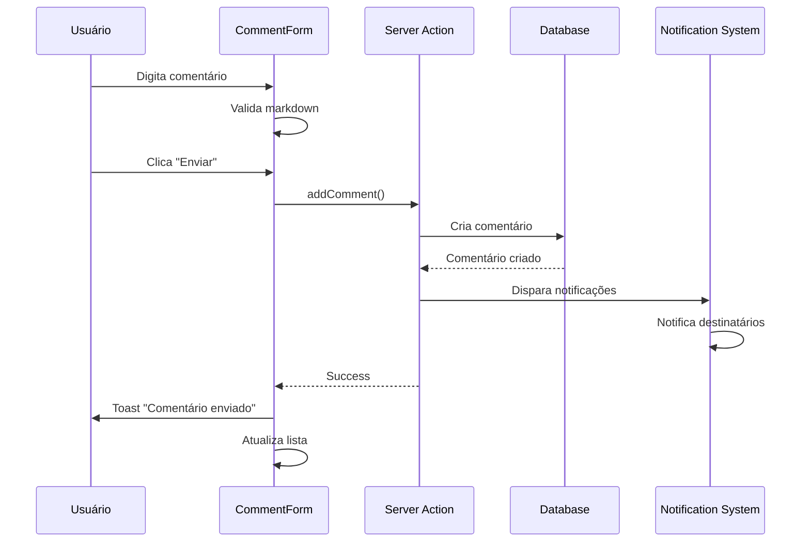

# Sistema de Comentários - 28Web Connect

## Visão Geral

O sistema de comentários permite comunicação bidirecional entre clientes e a equipe 28Web dentro de cada projeto. Os comentários podem ser organizados por milestone (etapa do projeto) ou como comentários gerais.

## Arquitetura

### Estrutura de Arquivos

```
├── app/actions/comments.ts          # Server Actions para CRUD de comentários
├── lib/validations/comments.ts      # Schemas Zod para validação
├── lib/comment-notifications.ts     # Lógica de notificações
├── components/project/
│   ├── CommentSection.tsx           # Componente principal (gerencia estado)
│   ├── CommentForm.tsx              # Formulário com suporte a markdown
│   ├── CommentItem.tsx              # Item individual de comentário
│   ├── MarkdownContent.tsx          # Renderizador de markdown
│   └── UserRoleBadge.tsx            # Badge de role do usuário
├── types/project.ts                  # Tipos TypeScript
└── docs/comments-system.md          # Esta documentação
```

### Modelo de Dados (Prisma)

```prisma
model ProjectComment {
  id          String   @id @default(cuid())
  projectId   String
  milestoneId String?  // Opcional: comentário geral ou específico
  userId      String
  content     String   @db.Text
  createdAt   DateTime @default(now())
  updatedAt   DateTime @updatedAt

  project   Project           @relation(fields: [projectId], references: [id], onDelete: Cascade)
  milestone ProjectMilestone? @relation(fields: [milestoneId], references: [id], onDelete: SetNull)
  user      User              @relation(fields: [userId], references: [id], onDelete: Cascade)
}
```

## Funcionalidades

### 1. Comentários por Milestone

- **Geral**: Comentários sobre o projeto como um todo
- **Por Etapa**: Comentários específicos de cada milestone do projeto

### 2. Suporte a Markdown

O sistema suporta formatação rica via GitHub Flavored Markdown:

| Sintaxe        | Resultado   |
| -------------- | ----------- | --- | ------ |
| `**negrito**`  | **negrito** |
| `*itálico*`    | _itálico_   |
| `` `código` `` | `código`    |
| `[link](url)`  | [link](url) |
| `- item`       | • item      |
| `~~riscado~~`  | ~~riscado~~ |
| `              | tabela      | `   | Tabela |

### 3. Notificações

**Cliente comenta → Notifica Admins**

- Mensagem: "Novo comentário de {nome} no projeto {projeto}"
- Canais: IN_APP, EMAIL

**Admin comenta → Notifica Cliente**

- Mensagem: "A equipe 28Web respondeu no projeto {projeto}"
- Canais: IN_APP, EMAIL, PUSH

### 4. Paginação Cursor-Based

- 10 comentários por página
- Carregamento sob demanda ("Carregar mais")
- Ordenação: mais recentes primeiro

### 5. Permissões

| Ação                        | Cliente (Dono) | Cliente (Outro) | Admin |
| --------------------------- | -------------- | --------------- | ----- |
| Ver comentários             | ✅             | ❌              | ✅    |
| Adicionar comentário        | ✅             | ❌              | ✅    |
| Deletar próprio comentário  | ✅             | ❌              | ✅    |
| Deletar qualquer comentário | ❌             | ❌              | ✅    |

## Fluxo de Uso

### Adicionar Comentário



### Carregar Mais Comentários

1. Usuário clica "Carregar mais"
2. Cliente envia cursor (ID do último comentário)
3. Server retorna próximos 10 comentários
4. UI concatena novos comentários à lista

## API (Server Actions)

### `addComment(input, userId)`

Cria um novo comentário.

```typescript
const result = await addComment(
  {
    projectId: '...',
    milestoneId: '...', // opcional
    content: 'Meu comentário em **markdown**',
  },
  userId
);

// Retorno: ActionResponse<CommentWithUser>
```

### `getCommentsByProject(input, userId)`

Busca comentários com paginação.

```typescript
const result = await getCommentsByProject(
  {
    projectId: '...',
    milestoneId: '...', // opcional
    cursor: '...', // opcional
    limit: 10,
  },
  userId
);

// Retorno: ActionResponse<CommentsPaginatedResponse>
```

### `deleteComment(input, userId)`

Remove um comentário (apenas autor ou admin).

```typescript
const result = await deleteComment(
  {
    commentId: '...',
  },
  userId
);

// Retorno: ActionResponse<void>
```

## Componentes React

### CommentSection

```tsx
<CommentSection
  projectId="..."
  milestones={milestones}
  initialComments={comments}
  userId="..."
  userRole={UserRole.CLIENTE}
/>
```

### CommentForm

```tsx
<CommentForm
  projectId="..."
  milestoneId="..." // opcional
  userId="..."
  onCommentAdded={(comment) => {}}
/>
```

### CommentItem

```tsx
<CommentItem comment={comment} canDelete={true} onDelete={(id) => {}} />
```

## Estilização

### Tema Escuro

- Fundo: `bg-dark-bg-secondary`
- Comentários cliente: `bg-dark-bg-primary`
- Comentários admin: `bg-accent-primary/5` com borda accent

### Avatares

- Cores determinísticas baseadas no hash do userId
- Iniciais do nome (máximo 2 caracteres)

### Badges de Role

- Admin: Laranja com ícone de escudo
- Cliente: Azul com ícone de usuário

## Troubleshooting

### Comentários não aparecem

1. Verificar se o projeto existe: `prisma.project.findUnique()`
2. Verificar permissões: usuário é dono ou admin?
3. Verificar console por erros do Server Action

### Notificações não são enviadas

1. Verificar `lib/comment-notifications.ts`
2. Verificar se `createNotification` está funcionando
3. Logs em `console.error` não bloqueiam criação do comentário

### Erro de validação

- Conteúdo vazio: mínimo 1 caractere
- Conteúdo muito longo: máximo 5000 caracteres
- ProjectId/MilestoneId deve ser CUID válido

## Melhorias Futuras

1. **Menções (@username)**: Detectar e notificar usuários mencionados
2. **Reações**: Like/dislike em comentários
3. **Anexos**: Permitir arquivos anexados a comentários
4. **Edição**: Permitir editar comentários (por tempo limitado)
5. **Threads**: Responder a comentários específicos
6. **WebSockets**: Atualizações em tempo real
7. **Typing indicator**: Mostrar quando alguém está digitando

## Dependências

```json
{
  "react-markdown": "^9.x",
  "remark-gfm": "^4.x",
  "date-fns": "^3.x"
}
```

## Changelog

### v1.0.0

- ✅ CRUD de comentários
- ✅ Suporte a markdown
- ✅ Notificações bidirecionais
- ✅ Paginação cursor-based
- ✅ Organização por milestone
- ✅ Permissões granulares
