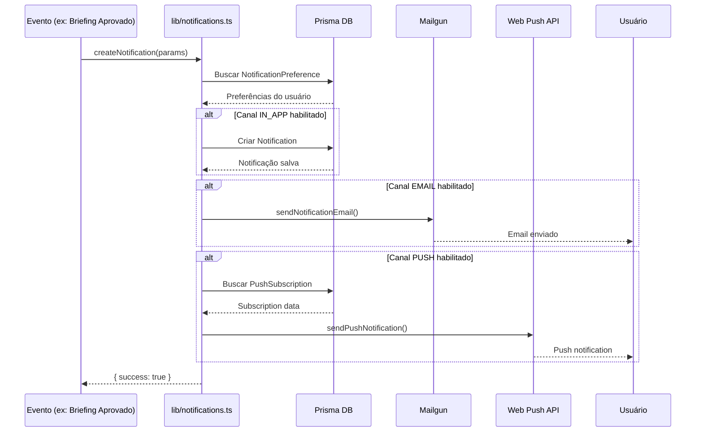
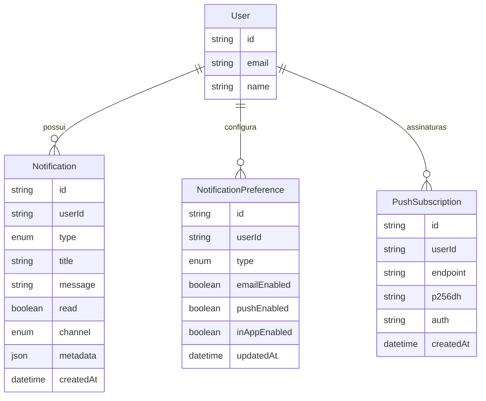

# Sistema de Notificações - 28Web Connect

## Arquitetura

O sistema de notificações é projetado para ser modular, escalável e extensível. Ele suporta três canais de entrega: **In-App**, **Email** e **Push Notifications**.

### Diagrama de Fluxo



### Modelos de Dados



## Tipos de Notificação

| Tipo                  | Descrição              | Canais Padrão       | Quando Disparada               |
| --------------------- | ---------------------- | ------------------- | ------------------------------ |
| `NOVO_BRIEFING`       | Novo briefing recebido | Email, In-App, Push | Quando cliente envia briefing  |
| `PROJETO_ATUALIZADO`  | Atualização no projeto | Email, In-App, Push | Status ou detalhes alterados   |
| `NOVA_MENSAGEM`       | Nova mensagem          | Email, In-App, Push | Mensagem no chat/suporte       |
| `ARQUIVO_SOLICITADO`  | Arquivo solicitado     | Email, In-App       | Admin solicita documento       |
| `PROJETO_CONCLUIDO`   | Projeto finalizado     | Email, In-App, Push | Projeto marcado como concluído |
| `BRIEFING_APROVADO`   | Briefing aprovado      | Email, In-App, Push | Admin aprova briefing          |
| `BRIEFING_REJEITADO`  | Briefing rejeitado     | Email, In-App       | Admin rejeita briefing         |
| `MILESTONE_CONCLUIDA` | Milestone concluída    | Email, In-App       | Etapa do projeto finalizada    |
| `SISTEMA`             | Notificação do sistema | In-App              | Atualizações de sistema        |

## Como Adicionar Novo Tipo de Notificação

1. **Adicionar ao enum no Prisma:**

   ```prisma
   enum NotificationType {
     // ... tipos existentes
     MEU_NOVO_TIPO
   }
   ```

2. **Executar migration:**

   ```bash
   npx prisma migrate dev --name add_notification_type
   ```

3. **Adicionar subject no template de email** (`lib/email-templates/notification-email.ts`):

   ```typescript
   const subjects: Record<NotificationType, string> = {
     // ... existentes
     MEU_NOVO_TIPO: 'Assunto do email',
   };
   ```

4. **Adicionar ícone e cor nos helpers** (`lib/notification-helpers.ts`):

   ```typescript
   const icons: Record<NotificationType, string> = {
     // ... existentes
     MEU_NOVO_TIPO: '🎯',
   };

   const colors: Record<NotificationType, string> = {
     // ... existentes
     MEU_NOVO_TIPO: 'blue',
   };
   ```

5. **Documentar neste arquivo** a descrição e quando é disparada.

## Exemplos de Uso

### Notificar cliente sobre briefing aprovado

```typescript
import { createNotification } from '@/lib/notifications';

await createNotification({
  userId: cliente.id,
  type: 'BRIEFING_APROVADO',
  title: 'Briefing Aprovado!',
  message: 'Seu briefing foi aprovado e o projeto será iniciado em breve.',
  channels: ['IN_APP', 'EMAIL', 'PUSH'],
  metadata: { briefingId: briefing.id },
});
```

### Buscar notificações do usuário

```typescript
import { getNotifications } from '@/app/actions/notifications';

const { success, data } = await getNotifications(userId, {
  unreadOnly: true,
  limit: 10,
});
```

### Atualizar preferências

```typescript
import { updateNotificationPreferences } from '@/app/actions/notifications';

await updateNotificationPreferences(userId, [
  {
    type: 'NOVO_BRIEFING',
    emailEnabled: true,
    pushEnabled: false,
    inAppEnabled: true,
  },
]);
```

## Configuração VAPID (Push Notifications)

### Gerar Keys

```bash
npx tsx scripts/generate-vapid-keys.ts
```

O script gerará:

- `VAPID_PUBLIC_KEY`
- `VAPID_PRIVATE_KEY`
- `NEXT_PUBLIC_VAPID_PUBLIC_KEY` (mesma chave pública para o frontend)

### Configurar no Ambiente

Adicione ao `.env.local`:

```env
VAPID_PUBLIC_KEY=sua-chave-publica
VAPID_PRIVATE_KEY=sua-chave-privada
VAPID_SUBJECT=mailto:noreply@28webconnect.com
NEXT_PUBLIC_VAPID_PUBLIC_KEY=sua-chave-publica
```

### Configuração em Produção

1. **HTTPS obrigatório** - Push notifications só funcionam em HTTPS
2. **Service Worker** - Deve estar registrado em `/service-worker.js`
3. **Manifest** - Recomendado ter um `manifest.json` para PWA

### Troubleshooting

| Problema         | Causa                 | Solução                                 |
| ---------------- | --------------------- | --------------------------------------- |
| Push não chega   | Subscription expirada | Implementar retry com nova subscription |
| 401 Unauthorized | VAPID keys incorretas | Verificar keys no .env                  |
| 410 Gone         | Subscription inválida | Remover subscription do banco           |
| Not shown        | Permissão negada      | Verificar `Notification.permission`     |

## Testes

### Testar Notificações In-App

```typescript
// Criar notificação de teste
await createNotification({
  userId: 'seu-user-id',
  type: 'SISTEMA',
  title: 'Teste',
  message: 'Esta é uma notificação de teste',
  channels: ['IN_APP'],
});
```

### Testar Emails

```typescript
import { sendNotificationEmail } from '@/lib/notifications';

await sendNotificationEmail({
  userId: 'seu-user-id',
  type: 'PROJETO_ATUALIZADO',
  title: 'Teste de Email',
  message: 'Verificando template de email',
  metadata: { actionUrl: 'http://localhost:3000/dashboard' },
});
```

### Testar Push Notifications

```typescript
// No navegador (cliente)
import { subscribeToPush, showLocalNotification } from '@/lib/push-subscription';

// Assinar
const subscription = await subscribeToPush();

// Testar local
showLocalNotification('Teste', {
  body: 'Notificação de teste',
  icon: '/assets/28connect.jpg',
});
```

### Mock de Push para Testes

```javascript
// No DevTools > Application > Service Workers
// Simular evento push:
self.registration.showNotification('Teste', {
  body: 'Mensagem de teste',
  icon: '/assets/28connect.jpg',
});
```

## Estrutura de Arquivos

```
prisma/
├── schema.prisma          # Modelos Notification, NotificationPreference, PushSubscription
├── seed.ts                # Seed de preferências padrão

app/
├── actions/
│   └── notifications.ts   # Server Actions

lib/
├── notifications.ts       # Core: createNotification, sendPushNotification
├── push-subscription.ts   # Client: subscribeToPush, unsubscribeFromPush
├── notification-helpers.ts # Utils: ícones, cores, formatação
├── validations/
│   └── notifications.ts   # Schemas Zod
└── email-templates/
    └── notification-email.ts # Templates de email

public/
└── service-worker.js      # Service worker para push

scripts/
└── generate-vapid-keys.ts # Gerador de VAPID keys

types/
└── notifications.ts       # Types TypeScript

docs/
└── notifications-system.md # Esta documentação
```

## Performance

- **Cache de Preferências**: Verificação de preferências usa cache de 5 minutos
- **Não bloqueante**: Erros em um canal não afetam outros
- **Lazy loading**: Service worker só é registrado quando necessário
- **Batch updates**: Marcar todas como lidas em uma operação

## Segurança

- **Validação de Ownership**: Usuário só acessa suas próprias notificações
- **Sanitização**: Metadata é validado com Zod antes de salvar
- **VAPID**: Chaves privadas nunca expostas no frontend
- **HTTPS**: Push notifications requerem conexão segura
