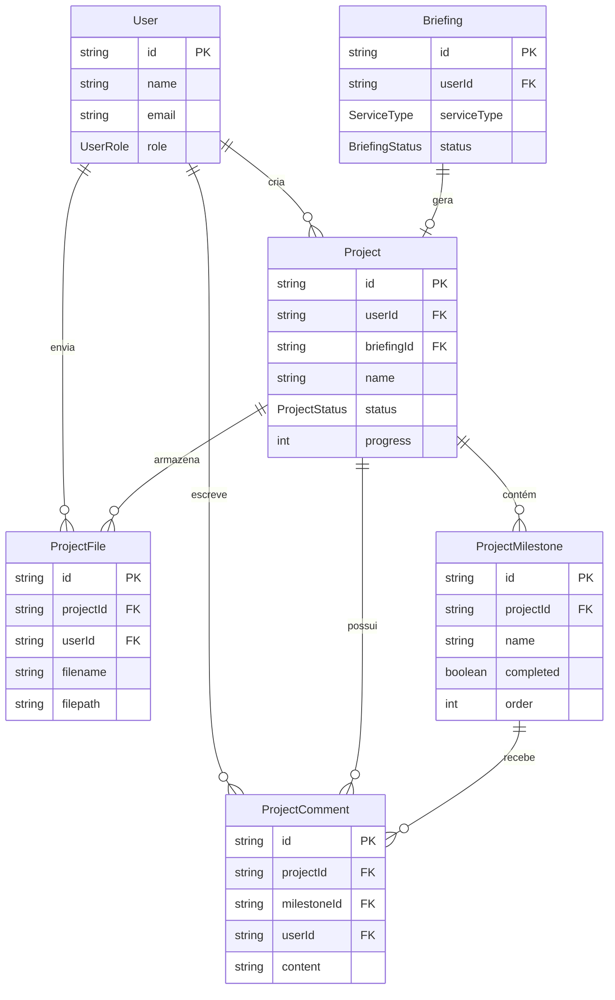

# Modelos de Projeto - 28Web Connect

## Estrutura de Dados

### Project

- **Propósito**: Representa um projeto ativo vinculado a um briefing aprovado
- **Relações**: User (1:N), Briefing (1:1 opcional), Milestones (1:N), Files (1:N), Comments (1:N)
- **Cálculo de Progresso**: Automático baseado em milestones concluídas (4 milestones = 25% cada)

### ProjectMilestone

- **Propósito**: Etapas do projeto (padrão: 4 etapas)
- **Ordem**: 1-Planejamento, 2-Desenvolvimento, 3-Testes, 4-Entrega
- **Relações**: Project (N:1), Comments (1:N)

### ProjectFile

- **Propósito**: Arquivos enviados por cliente ou admin
- **Armazenamento**: Sistema de arquivos local em `uploads/projects/{projectId}/`
- **Validação**: Tipo, tamanho, limite de storage por plano
- **Relações**: Project (N:1), User (N:1)

### ProjectComment

- **Propósito**: Comunicação contextual entre cliente e equipe
- **Contexto**: Pode ser geral (projeto) ou específico (milestone)
- **Notificações**: Automáticas ao comentar
- **Relações**: Project (N:1), Milestone (N:1 opcional), User (N:1)

## Fluxo de Dados

1. Cliente envia Briefing
2. Admin aprova Briefing → cria Project automaticamente
3. Project inicia com status AGUARDANDO_APROVACAO
4. Admin ativa projeto → status ATIVO
5. Admin marca milestones como concluídas → atualiza progress
6. Cliente e admin trocam comentários e arquivos
7. Todas milestones concluídas → status CONCLUIDO

## Diagrama de Relacionamentos

