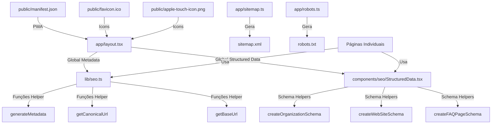

# Estratégia de SEO - 28Web Connect

Este documento descreve a estratégia de SEO implementada no projeto 28Web Connect, incluindo estrutura de metadata, uso da biblioteca centralizada, e melhores práticas para novas páginas.

## Índice

1. [Visão Geral](#visão-geral)
2. [Biblioteca Centralizada de SEO](#biblioteca-centralizada-de-seo)
3. [Componente de Structured Data](#componente-de-structured-data)
4. [Estrutura de Metadata](#estrutura-de-metadata)
5. [Páginas Indexáveis vs. Não-Indexáveis](#páginas-indexáveis-vs-não-indexáveis)
6. [Guia de Uso da Biblioteca SEO](#guia-de-uso-da-biblioteca-seo)
7. [Checklist para Novas Páginas](#checklist-para-novas-páginas)
8. [Ferramentas de Teste](#ferramentas-de-teste)
9. [Próximos Passos](#próximos-passos)

---

## Visão Geral

O projeto 28Web Connect utiliza uma abordagem centralizada para SEO, com:

- **Biblioteca centralizada** (`lib/seo.ts`) para geração consistente de metadata
- **Componente reutilizável** (`components/seo/StructuredData.tsx`) para structured data JSON-LD
- **Sitemap dinâmico** (`app/sitemap.ts`) gerado automaticamente
- **Robots.txt dinâmico** (`app/robots.ts`) com regras de crawling
- **Assets PWA completos** (manifest.json, favicons, ícones)
- **Metadata otimizada** em todas as páginas públicas

### Arquitetura



---

## Biblioteca Centralizada de SEO

### Arquivo: `lib/seo.ts`

A biblioteca `seo.ts` fornece funções utilitárias para geração consistente de metadata:

#### Funções Disponíveis

##### `generateMetadata(params)`

Gera metadata completa para uma página.

**Parâmetros:**

- `title?: string` - Título da página (opcional, usa template padrão)
- `description?: string` - Descrição da página (opcional, usa padrão)
- `path: string` - Caminho da página (obrigatório)
- `keywords?: string[]` - Palavras-chave (opcional)
- `type?: 'website' | 'article' | 'product'` - Tipo de conteúdo (padrão: 'website')
- `image?: string` - URL da imagem OG (opcional, usa padrão)
- `robots?: { index?: boolean; follow?: boolean }` - Configuração de robots (opcional)

**Retorno:** Objeto `Metadata` completo do Next.js

**Exemplo de uso:**

```typescript
export const metadata: Metadata = generateMetadata({
  title: 'Sobre Nós',
  description: 'Conheça a história da 28Web Connect...',
  path: 'sobre',
  keywords: ['sobre', 'história', 'empresa'],
  type: 'website',
});
```

##### `getBaseUrl()`

Retorna a URL base do site a partir da variável de ambiente `NEXT_PUBLIC_SITE_URL` ou fallback.

**Retorno:** `string` - URL base do site

##### `getCanonicalUrl(path: string)`

Combina a URL base com o caminho fornecido para criar a URL canônica.

**Parâmetros:**

- `path: string` - Caminho da página

**Retorno:** `string` - URL canônica completa

##### `getDefaultImage()`

Retorna a URL da imagem padrão para OpenGraph.

**Retorno:** `string` - URL da imagem padrão

#### Constantes Exportadas

- `DEFAULT_TITLE` - Título padrão do site
- `DEFAULT_DESCRIPTION` - Descrição padrão do site
- `SITE_NAME` - Nome do site
- `TWITTER_HANDLE` - Handle do Twitter

---

## Componente de Structured Data

### Arquivo: `components/seo/StructuredData.tsx`

Componente React para renderizar JSON-LD de forma type-safe com validação em desenvolvimento.

#### Uso Básico

```tsx
import StructuredData from '@/components/seo/StructuredData';

<StructuredData data={schemaObject} />;
```

#### Funções Helper Disponíveis

##### `createOrganizationSchema()`

Cria schema de Organization para a empresa.

**Retorno:** Objeto schema.org Organization com:

- name, url, logo, description
- sameAs (redes sociais)
- contactPoint (email, telefone, horário)

##### `createWebSiteSchema()`

Cria schema de WebSite.

**Retorno:** Objeto schema.org WebSite com:

- name, url, description
- potentialAction: SearchAction (busca no site)

##### `createFAQPageSchema(faqs)`

Cria schema de FAQPage.

**Parâmetros:**

- `faqs: Array<{ question: string; answer: string }>` - Lista de FAQs

**Retorno:** Objeto schema.org FAQPage

**Exemplo:**

```tsx
<StructuredData data={createFAQPageSchema(faqs)} />
```

##### `createBreadcrumbSchema(items)`

Cria schema de BreadcrumbList.

**Parâmetros:**

- `items: Array<{ name: string; url: string }>` - Lista de itens do breadcrumb

**Retorno:** Objeto schema.org BreadcrumbList

##### `createProductSchema(product)`

Cria schema de Product/Serviço.

**Parâmetros:**

- `product: { name, description, image?, price?, currency?, availability? }`

**Retorno:** Objeto schema.org Product

##### `createArticleSchema(article)`

Cria schema de Article/Post.

**Parâmetros:**

- `article: { title, description, url, image?, datePublished, dateModified?, author? }`

**Retorno:** Objeto schema.org Article

---

## Estrutura de Metadata

### Metadata Gerada Automaticamente

A função `generateMetadata()` gera automaticamente:

1. **Title** - Com template `%s | 28Web Connect`
2. **Description** - 150-160 caracteres ideal
3. **Keywords** - Array de palavras-chave
4. **Authors** - Nome da empresa
5. **Creator/Publisher** - Nome da empresa
6. **Format Detection** - Desabilita auto-detecção de telefone
7. **Metadata Base** - URL base para URLs relativas
8. **Canonical URL** - URL canônica sempre incluída
9. **OpenGraph** - title, description, url, type, locale, siteName, images
10. **Twitter Card** - summary_large_image, title, description, creator, images
11. **Robots** - index/follow configurável (opcional)

### Exemplo Completo

```typescript
export const metadata: Metadata = generateMetadata({
  title: 'Nossos Serviços',
  description: 'Soluções completas em desenvolvimento web, ERP, e-commerce e agentes de IA.',
  path: 'servicos',
  keywords: ['ERP', 'e-commerce', 'desenvolvimento web', 'IA'],
  type: 'website',
});
```

---

## Páginas Indexáveis vs. Não-Indexáveis

### Páginas Indexáveis (Públicas)

Estas páginas devem ser indexadas pelos motores de busca:

- `/` - Home page
- `/servicos` - Página de serviços
- `/sobre` - Sobre nós
- `/faq` - Perguntas frequentes
- `/contato` - Contato
- `/politica-privacidade` - Política de privacidade
- `/termos-uso` - Termos de uso
- `/politica-cookies` - Política de cookies

### Páginas Não-Indexáveis (Privadas/Auth)

Estas páginas NÃO devem ser indexadas:

- `/login` - Login
- `/cadastro` - Cadastro
- `/recuperar-senha` - Recuperação de senha
- `/verificar-email` - Verificação de email
- `/redefinir-senha/*` - Redefinição de senha
- `/dashboard/*` - Área do cliente
- `/admin/*` - Área administrativa
- `/api/*` - APIs

### Configuração de Robots

O arquivo `app/robots.ts` configura:

- `Allow: /` - Permite crawling do site
- `Disallow: /dashboard/*` - Bloqueia dashboard
- `Disallow: /admin/*` - Bloqueia admin
- `Disallow: /api/*` - Bloqueia APIs
- `Disallow: /cadastro` - Bloqueia cadastro
- `Disallow: /login` - Bloqueia login
- `Disallow: /recuperar-senha` - Bloqueia recuperação de senha
- `Disallow: /verificar-email` - Bloqueia verificação de email
- `Disallow: /redefinir-senha/*` - Bloqueia redefinição de senha

---

## Guia de Uso da Biblioteca SEO

### Adicionar Metadata a uma Nova Página

1. **Importe a função:**

```typescript
import { generateMetadata } from '@/lib/seo';
```

2. **Exporte a metadata:**

```typescript
export const metadata: Metadata = generateMetadata({
  title: 'Título da Página',
  description: 'Descrição da página (150-160 caracteres)',
  path: 'caminho-da-pagina',
  keywords: ['palavra-chave1', 'palavra-chave2'],
  type: 'website',
});
```

3. **Para páginas de autenticação, adicione robots:**

```typescript
export const metadata: Metadata = generateMetadata({
  title: 'Criar Conta',
  description: 'Crie sua conta gratuita...',
  path: 'cadastro',
  robots: { index: false, follow: false },
});
```

### Adicionar Structured Data a uma Página

1. **Importe o componente e helpers:**

```typescript
import StructuredData, { createFAQPageSchema } from '@/components/seo/StructuredData';
```

2. **Adicione no JSX:**

```tsx
export default function MinhaPagina() {
  return (
    <>
      <StructuredData data={createFAQPageSchema(faqs)} />
      {/* Resto do conteúdo */}
    </>
  );
}
```

3. **Nota:** O schema de Organization já está incluído no root layout, não precisa ser repetido.

---

## Checklist para Novas Páginas

Ao criar uma nova página, verifique:

### Metadata

- [ ] Título único e descritivo (50-60 caracteres)
- [ ] Descrição com 150-160 caracteres
- [ ] Palavras-chave relevantes
- [ ] Canonical URL configurada
- [ ] OpenGraph tags presentes (title, description, url, type, images)
- [ ] Twitter Card configurado
- [ ] Para páginas privadas: `robots: { index: false }`

### Structured Data

- [ ] Schema apropriado para o tipo de conteúdo
- [ ] Validação com [Schema.org Validator](https://validator.schema.org/)
- [ ] Teste de Rich Results no [Google Rich Results Test](https://search.google.com/test/rich-results)

### Conteúdo

- [ ] H1 único e descritivo
- [ ] Headings hierárquicos (H2-H6)
- [ ] Links internos relevantes
- [ ] Imagens otimizadas com alt text
- [ ] URLs amigáveis
- [ ] Conteúdo relevante e de qualidade

### Performance

- [ ] Imagens usando `next/image` com otimização
- [ ] Formatos modernos (WebP/AVIF) sendo servidos
- [ ] Sem erros de console relacionados a SEO
- [ ] Lighthouse score > 90

---

## Ferramentas de Teste

### Ferramentas Recomendadas

1. **Google Search Console**
   - URL: https://search.google.com/search-console
   - Uso: Monitorar indexação, erros de crawling, performance

2. **Lighthouse**
   - Integrado no Chrome DevTools
   - Uso: Testar performance, SEO, acessibilidade

3. **Schema.org Validator**
   - URL: https://validator.schema.org/
   - Uso: Validar structured data JSON-LD

4. **Google Rich Results Test**
   - URL: https://search.google.com/test/rich-results
   - Uso: Testar rich snippets

5. **Open Graph Debugger (Facebook)**
   - URL: https://developers.facebook.com/tools/debug/
   - Uso: Testar OpenGraph tags

6. **Twitter Card Validator**
   - URL: https://cards-dev.twitter.com/validator
   - Uso: Testar Twitter Cards

7. **Screaming Frog SEO Spider**
   - URL: https://www.screamingfrog.com/seo-spider/
   - Uso: Auditar crawling, encontrar problemas técnicos

### Processo de Validação

1. **Desenvolvimento:**
   - Validar HTML com W3C Validator
   - Testar structured data localmente
   - Verificar console para erros

2. **Staging:**
   - Testar com todas as ferramentas acima
   - Verificar sitemap e robots.txt
   - Validar mobile-friendliness

3. **Produção:**
   - Submeter sitemap no Google Search Console
   - Monitorar indexação nos primeiros dias
   - Acompanhar performance com Lighthouse

---

## Próximos Passos (Futuro)

### Curto Prazo

- [ ] Implementar breadcrumbs com structured data
- [ ] Adicionar FAQ schema em mais páginas
- [ ] Criar blog com artigos otimizados
- [ ] Implementar rich snippets para serviços

### Médio Prazo

- [ ] Adicionar schema de LocalBusiness (se aplicável)
- [ ] Implementar schema de Review/Rating
- [ ] Criar páginas de serviço individuais
- [ ] Adicionar schema de VideoObject (se aplicável)

### Longo Prazo

- [ ] Implementar hreflang para multilíngua
- [ ] Adicionar schema de Event (para webinars, eventos)
- [ ] Implementar schema de Course (para tutoriais)
- [ ] Criar sistema de análise de concorrentes

---

## Referências

- [Next.js Metadata Documentation](https://nextjs.org/docs/app/api-reference/file-conventions/metadata)
- [Next.js Sitemap Documentation](https://nextjs.org/docs/app/api-reference/file-conventions/metadata/sitemap)
- [Next.js Robots Documentation](https://nextjs.org/docs/app/api-reference/file-conventions/metadata/robots)
- [Schema.org](https://schema.org/)
- [Open Graph Protocol](https://ogp.me/)
- [Twitter Cards](https://developer.twitter.com/en/docs/twitter-for-websites/cards/overview)

---

## Contato

Para dúvidas sobre SEO ou sugestões de melhoria, entre em contato com a equipe de desenvolvimento.
